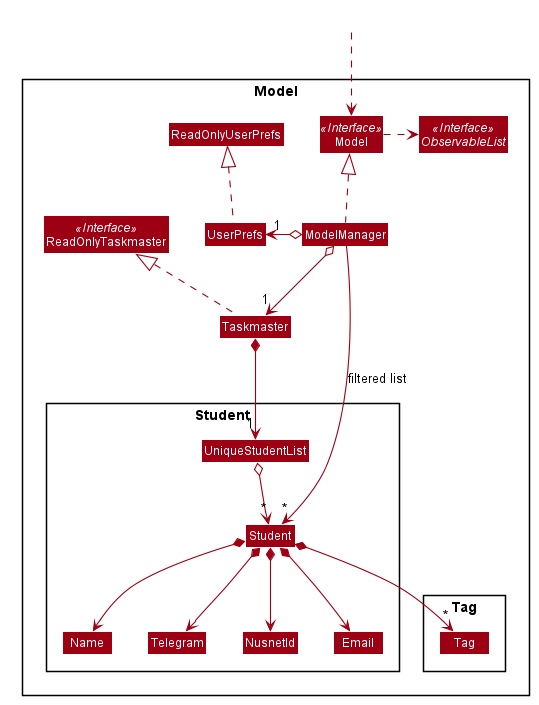
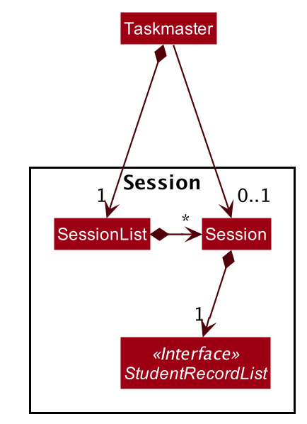
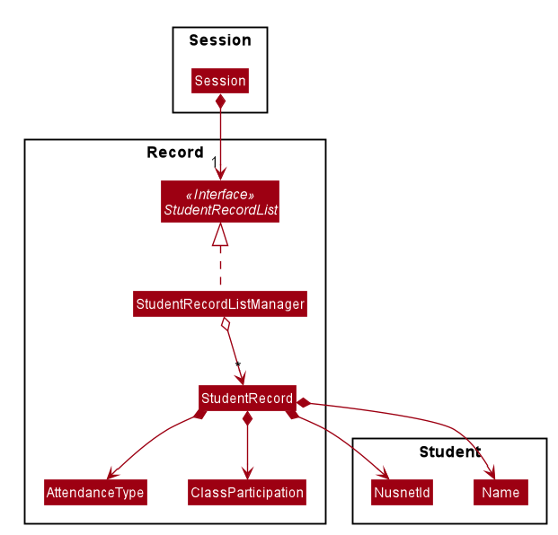
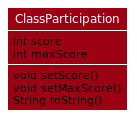

* Table of Contents
{:toc}

--------------------------------------------------------------------------------------------------------------------

## **Setting up, getting started**

Refer to the guide [_Setting up and getting started_](SettingUp.md).

--------------------------------------------------------------------------------------------------------------------

## **Design**

### Architecture

The ***Architecture Diagram*** given above explains the high-level design of the App. Given below is a quick overview of each component.

:bulb: **Tip:** The `.puml` files used to create diagrams in this document can be found in the [diagrams](https://github.com/AY2021S1-CS2103-F09-1/tp/tree/master/docs/diagrams/) folder. Refer to the [_PlantUML Tutorial_ at se-edu/guides](https://se-education.org/guides/tutorials/plantUml.html) to learn how to create and edit diagrams.

**`Main`** has two classes called [`Main`](https://github.com/AY2021S1-CS2103-F09-1/tp/tree/master/src/main/java/seedu/address/Main.java) and [`MainApp`](https://github.com/AY2021S1-CS2103-F09-1/tp/tree/master/src/main/java/seedu/address/MainApp.java). It is responsible for,
* At app launch: Initializes the components in the correct sequence, and connects them up with each other.
* At shut down: Shuts down the components and invokes cleanup methods where necessary.

[**`Commons`**](#common-classes) represents a collection of classes used by multiple other components.

The rest of the App consists of four components.

* [**`UI`**](#ui-component): The UI of the App.
* [**`Logic`**](#logic-component): The command executor.
* [**`Model`**](#model-component): Holds the data of the App in memory.
* [**`Storage`**](#storage-component): Reads data from, and writes data to, the hard disk.

Each of the four components,

* defines its *API* in an `interface` with the same name as the Component.
* exposes its functionality using a concrete `{Component Name}Manager` class (which implements the corresponding API `interface` mentioned in the previous point.

For example, the `Logic` component (see the class diagram given below) defines its API in the `Logic.java` interface and exposes its functionality using the `LogicManager.java` class which implements the `Logic` interface.

**How the architecture components interact with each other**

The *Sequence Diagram* below shows how the components interact with each other for the scenario where the user issues the command `delete 1`.

The sections below give more details of each component.

### UI component

**API** :
[`Ui.java`](https://github.com/AY2021S1-CS2103-F09-1/tp/tree/master/src/main/java/seedu/address/ui/Ui.java)

The UI consists of a `MainWindow` that is made up of parts e.g.`CommandBox`, `ResultDisplay`, `StudentListPanel`, `StatusBarFooter` etc. All these, including the `MainWindow`, inherit from the abstract `UiPart` class.

The `UI` component uses JavaFx UI framework. The layout of these UI parts are defined in matching `.fxml` files that are in the `src/main/resources/view` folder. For example, the layout of the [`MainWindow`](https://github.com/AY2021S1-CS2103-F09-1/tp/tree/master/src/main/java/seedu/address/ui/MainWindow.java) is specified in [`MainWindow.fxml`](https://github.com/AY2021S1-CS2103-F09-1/tp/tree/master/src/main/resources/view/MainWindow.fxml)

The `UI` component,

* Executes user commands using the `Logic` component.
* Listens for changes to `Model` data so that the UI can be updated with the modified data.

### Logic component

**API** :
[`Logic.java`](https://github.com/AY2021S1-CS2103-F09-1/tp/tree/master/src/main/java/seedu/address/logic/Logic.java)

1. `Logic` uses the `TaskmasterParser` class to parse the user command.
1. This results in a `Command` object which is executed by the `LogicManager`.
1. The command execution can affect the `Model` (e.g. adding a student).
1. The result of the command execution is encapsulated as a `CommandResult` object which is passed back to the `Ui`.
1. In addition, the `CommandResult` object can also instruct the `Ui` to perform certain actions, such as displaying help to the user.

Given below is the Sequence Diagram for interactions within the `Logic` component for the `execute("delete 1")` API call.

:information_source: **Note:** The lifeline for `DeleteCommandParser` should end at the destroy marker (X) but due to a limitation of PlantUML, the lifeline reaches the end of diagram.

### Model component

**API** : [`Model.java`](https://github.com/AY2021S1-CS2103-F09-1/tp/tree/master/src/main/java/seedu/address/model/Model.java)

The `Model`,

* stores a `UserPref` object that represents the user’s preferences.
* stores the student list data as a `Taskmaster` object.
* exposes an unmodifiable `ObservableList<Student>` that can be 'observed' e.g. the UI can be bound to this list so that the UI automatically updates when the data in the list change.
* also exposes an unmodifiable `ObservableList<Session>` that is similarly used by the UI.
* does not depend on any of the other three components.

:information_source: **Note:** An alternative (arguably, a more OOP) model is given below. It has a `Tag` list in the `AddressBook`, which `Student` references. This allows `AddressBook` to only require one `Tag` object per unique `Tag`, instead of each `Student` needing their own `Tag` object. 

### Storage component

**API** : [`Storage.java`](https://github.com/AY2021S1-CS2103-F09-1/tp/tree/master/src/main/java/seedu/address/storage/Storage.java)

The `Storage` component,
* can save `UserPref` objects in json format and read it back.
* can save the student list data in json format and read it back.
* can save the SessionList data in json format and read it back.

### Common classes

Classes used by multiple components are in the `seedu.taskmaster.commons` package.

--------------------------------------------------------------------------------------------------------------------

## **Additional Features to Be Implemented**

### SessionList

Author: **Joshua Chew**
* Implementing the classes that encapsulate a list of tutorial sessions.

The `SessionList`,

* is stored by the Taskmaster.
* encapsulates a list of zero, one or more Session objects.
* can provide a list of the names of all Session objects that it contains (to pass to the UI).

The `Session`,

* stores a SessionName.
* stores a StudentRecordList.
* can mark the attendance of a particular student in the StudentRecordList.
* can mark the attendance of all students in the StudentRecordList with a single Command.

The current running Session is also stored as an attribute in the Taskmaster.

Given below is the planned Sequence Diagram for interactions within the `Session` component for the `Taskmaster#markStudentWithNusnetId(nusnetId, attendanceType)` API call.

 

### StudentRecordList

Author: **Goh Siau Chiak**

* Implementing the classes that encapsulate a list of student records.

The `StudentRecordList`,
* is stored by a `Session`.
* encapsulates a list of zero or more `StudentRecord` objects.
* can provide a list of the `StudentRecord` objects that it contains (to pass to the UI).
* can mark the attendance of a student in the `Session`.

The `StudentRecord`,
* represents an immutable record of a student's attendance in a particular `Session`
* contains
  * a `NusnetId` that indicates which student the record represents
  * the `Name` of the student represented
  * the `AttendanceType` of the student for the `Session`
  * a `ClassParticipation` representing the score awarded to the student for participating in the `Session`

When the user wants to update the attendance or class participation score, a new `StudentRecord` object will be created. 

Given below is the Sequence Diagram for interactions within the `StudentRecordListManager` component when `StudentRecordListManager#markStudentAttendance(nusnetId, attendanceType)` is called.

Considerations for `markStudentAttendance`:
    
On one hand, the mark command uses an index to identify the record, for ease of usage for the user, as compared to 
having to type out the record's NUSNET ID. On the other hand, the mark attendance method within the `Model` identifies 
the record to mark using its NUSNET ID, to ensure correctness. Furthermore, the student records have to be stored in a 
JavaFX `ObservableList` to be easily displayable on the GUI. In the end, I decided to find the record to mark by 
iterating through the record list and comparing NUSNET IDs, since each student's NUSNET ID must be unique. The `O(N)`
time complexity of this method does not incur significant time cost because we expect there to be no more than 1000
students recorded in any session created by TAs using TAskmaster.

Design alternatives:
- Make `StudentRecord` mutable.

    This was the original design of `StudentRecord` which made sense at the time because a student's record
    would be frequently updated for marking of attendnace and awarding of class participation scores. However,
    the JavaFX `ObservableList` interface is **not notified when contained objects are modified**, only when 
    objects were added or deleted. This resulted in a bug where the GUI will not show the changes made when a
    student record was updated. In the end, it was decided that `StudentRecord` should be immutable to fix this bug.

- Make each `StudentRecordList` be dependent on and backed by the `StudentList` maintained by TAskmaster.

    This alternative was eventually rejected because it did not make sense from a design perspective. Each
    student record list represents the record of students **for that particular session only**. If we 
    implemented this alternative, edits to the student list will result in changes to all the student record
    lists, which does not follow the design of the student record list. For example:
    - suppose a TA is currently teaching three students, `A, B, C`
    - when the TA creates a new session `S1` , it will contain three corresponding student records
    - subsequently after the session is over, student `A` informs the TA that he is going to drop the module
    - when the TA deletes student `A` from the student list, the student record list of `S1` will update and
    no longer reflect that `A` was enrolled in the module when `S1` occurred

- Have `StudentRecord` contain the whole `Student` object, not just its `Name` and `NusnetId`

    This was considered and ultimately rejected because of the design considerations in the previous 
    alternative. Each student record, once created, is supposed to be independent of the student in the
    student list. This implies that subsequent changes to the student should not be known by the student
    record. Moreover, each student record only needs to know the name and NUSNET ID of the student at the moment 
    it was created and there is no need for it to know the rest of the student's information. 
    
    Furthermore, having
    each student record contain a student object will incur significant memory usage, especially since for most
    TAs, the same set of students will be enrolled in multiple sessions, each with a student record list. 
    Following the **Law of Demeter**, it was decided to restrict the student record to only have the name and NUSNET ID.
    Since editing of `NusnetId` is not allowed, there will be no issues with syncing of data. For example, even if the
    name of a particular student is edited after his `StudentRecord` was saved, we can find that student using their
    `NusnetId`.

 

### Storage

Author: **Jaya Rengam**
* Change/Add classes in the Storage package to store data related to Sessions.

A new method `JsonTaskmasterStorage#saveSessionList` will store the SessionList in the running Taskmaster to a separate .json file.
* The SessionList will be represented by a `JsonSerializableSessionList`, which contains a `List<JsonSerializableSession>`
* Each `JsonSerializableSession` will contain a `List<JsonAdaptedStudentRecord>`

**To-Do:**
* Update `TaskmasterStorage` interface (add `saveSessionList(ReadOnlyTaskmaster taskmaster)` method)
* Implement `saveSessionList` method in `JsonTaskmasterStorage`
* Create the new `JsonSerializable..`/`JsonAdapted..` classes
 

**_Notes from developer:_**
* This implementation of the feature uses Jackson libraries/formatting that is used in existing AB3 Storage classes
 

Alternative implementations:
* Store the SessionList as a JSON field in the existing Taskmaster file
    * Doing it this way would mean that the file would be repeatedly overwritten and any format errors will invalidate the whole file, including the StudentList.

### ClassParticipation

Author: **Theodore Leebrant**
* Implementing the class in charge of representing the class participation of each student in a session.

The `ClassParticipation` is planned to
* store a `score` and the maximum score (`maxScore`) attainable
* have mutators for both the score and the maximum score.
* be used by the StudentRecord

**To do**
* make a corresponding command in Taskmaster to set score
* implement a default scoring system at launch

Given below is the planned Sequence Diagram for interaction to set the class participation mark via `Taskmaster#markStudentParticipation(nusnetId, score)`.

 

### UI

Author: **Lim Jin Feng**
* Change/Add classes in the UI package to display newly implemented functionality such as ClassRecords.

A new method `MainWindow#fillInnerParts2` will change the contents of the Ui to the student record, from the student list.
* This is implemented in such a way to accomodate future expansion.

**To-Do:**
* Support displaying of Sessions when Sessions are implemented.
* Support displaying of any new future implementation.

**_Notes from developer:_**
* Implementation still buggy: Ui does not update accordingly for student records.

Alternative implementations considered:
* Use FXML's tab feature to display class records
    * Does not support future expansion when sessions is implemented - there may be an indefinite amount of sessions created.
--------------------------------------------------------------------------------------------------------------------

## **Documentation, logging, testing, configuration, dev-ops**

* [Documentation guide](Documentation.md)
* [Testing guide](Testing.md)
* [Logging guide](Logging.md)
* [Configuration guide](Configuration.md)
* [DevOps guide](DevOps.md)

--------------------------------------------------------------------------------------------------------------------

## **Appendix: Requirements**

### Product scope

**Target user profile**:

* is an Undergraduate CS Teaching Assistant
* has a need to manage their students:
    * attendance
    * participation
* can type fast
* prefers typing to mouse interactions
* is reasonably comfortable using CLI apps

**Value proposition**:
* manage students faster than a typical mouse/GUI driven app
* view student details at a glance
* add and remove students easily
* create student records for each individual class conducted
* mark and view attendance and class participation in these classes quickly

### User stories

Priorities: High (must have) - `* * *`, Medium (nice to have) - `* *`, Low (unlikely to have) - `*`

| Priority | As a …​                                    | I want to …​                     | So that I can…​                                             |
| -------- | ------------------------------------------ | -------------------------------- | ----------------------------------------------------------- |
| `* * *`  | user                                       | add a new student                |                                                             |
| `* * *`  | user                                       | view details of a student        | have quick access to them                                   |
| `* * *`  | user                                       | view details of all my students  | have quick access to them                                   |
| `* * *`  | user                                       | delete a student                 |                                                             |

*{More to be added}*

### Use cases

(For all use cases below, the **System** is `Taskmaster` and the **Actor** is the `user`, unless specified otherwise)
 
**Use case: Add a student**

**MSS**

1.  User requests to add a new student
2.  System shows the added student

Use case ends.

**Extensions**

* 1a. The given input is invalid.
    * 1a1. System shows an error message.
      Use case resumes at step 1.
 

**Use case: View a student's details**

**MSS**

1.  User requests to view a student's details
2.  System shows the student's details

Use case ends.

**Extensions**

* 1a. The given input is invalid.
    * 1a1. System shows an error message.
      Use case resumes at step 1.
 

**Use Case: Mark Student Attendance**

**MSS**
1. User requests to mark student as present/absent
2. System shows student attendance as present/absent

Use case ends.

**Extensions**

* 1a. The given input is invalid.
    * 1a1. System shows an error message.
      Use case resumes at step 1.
 

**Use Case: View all students' details**

**MSS**
1. User requests to view all students' details
2. System shows all students' details.

Use case ends.
 

**Use Case: Delete a student**

**MSS**
1. User requests to list students
2. System shows a list of students
3. User requests to delete a specific student in the list
4. System deletes student

Use case ends.

Extensions
* 2a. The list is empty.  
    Use case ends.
    
* 3a. The given input is invalid.
    * 3a1. System shows an error message.
        Use case resumes at step 2.
 

**Use Case: Add a session**

**MSS**
1. User requests to add a session
2. System adds the session and shows the student records for that session with default fields

Extensions
* 1a. The given input is invalid.
    * 1a1. System shows an error message.
        Use case resumes at step 1.
        
* 1b. The name of the session given by the user is already in use.
    * 1b1. System shows an error message.
        Use case resumes at step 1.

 

**Use Case: Change view to a session**

**MSS**
1. User requests to view information (student records) of a session
2. System displays student records of that session

Extensions
* 1a. The given input is invalid.
    * 1a1. System shows an error message.
        Use case resumes at step 1.
        
 

**Use Case: Delete a session**

**MSS**
1. User requests to delete a session
2. System deletes the session

Extensions
* 1a. The given input is invalid.
    * 1a1. System shows an error message.
        Use case resumes at step 1.

 

**Use Case: Mark a student's attendance**

**MSS**
1. User requests to mark student attendance.
2. System marks the student's attendance within the context of that session.

Extensions
* 1a. System is not within the context of a session.
    * 1a1. System shows an error message.
    Use case ends.
    
* 1b. The given input is invalid.
    * 1b1. System shows an error message.
        Use case resumes at step 1.

 

**Use Case: Mark all students attendance**

**MSS**
1. User requests to mark all students' attendance.
2. System marks all student attendances within the context of that session.

Extensions
* 1a. System is not within the context of a session.
    * 1a1. System shows an error message.
    Use case ends.
    
* 1b. The given input is invalid.
    * 1b1. System shows an error message.
        Use case resumes at step 1.

 

**Use Case: Score student's participation**

**MSS**
1. User requests to score participation.
2. System scores the student's participation within the context of that session.

Extensions
* 1a. System is not within the context of a session.
    * 1a1. System shows an error message.
    Use case ends.
    
* 1b. The given input is invalid.
    * 1b1. System shows an error message.
        Use case resumes at step 1.

 

**Use Case: Score all students' participation**

**MSS**
1. User requests to score all students' participation.
2. System scores all student participation within the context of that session.

Extensions
* 1a. System is not within the context of a session.
    * 1a1. System shows an error message.
    Use case ends.
    
* 1b. The given input is invalid.
    * 1b1. System shows an error message.
        Use case resumes at step 1.

**Use Case: View all students with the lowest participation score**

**MSS**
1. User requests to view all students with the lowest participation score.
2. System shows all students with the lowest participation score.

### Non-Functional Requirements

1.  Should work on any _mainstream OS_ as long as it has Java `11` or above installed.
2.  Should work without requiring an installer, the installation of any additional software, or any external connections.
3.  Should only be for a single user.
4.  Should be able to hold up to 1000 students without a noticeable sluggishness in performance for typical usage.
5.  A user with above average typing speed for regular English text (i.e. not code, not system admin commands) should be able to accomplish most of the tasks faster using commands than using the mouse.
6.  Should store data locally _only_, in a human editable text file
7.  Total file size should not exceed 100MB.

*{More to be added}*

### Glossary

* **Mainstream OS**: Windows, Linux, Unix, macOS
* **Private contact detail**: A contact detail that is not meant to be shared with others (e.g. NUSNET ID)

--------------------------------------------------------------------------------------------------------------------

## **Appendix: Instructions for manual testing**

Given below are instructions to test the app manually.

:information_source: **Note:** These instructions only provide a starting point for testers to work on;
testers are expected to do more *exploratory* testing.

### Launch and shutdown

1. Initial launch

   1. Download the jar file and copy into an empty folder

   1. Double-click the jar file Expected: Shows the GUI with a set of sample students. The window size may not be optimal.

1. Saving window preferences

   1. Resize the window to an optimum size. Move the window to a different location. Close the window.

   1. Re-launch the app by double-clicking the jar file. 
       Expected: The most recent window size and location is retained.

1. _{ more test cases …​ }_

### Deleting a student

1. Deleting a student while all students are being shown

   1. Prerequisites: List all students using the `list` command. Multiple students in the list.

   1. Test case: `delete 1` 
      Expected: First contact is deleted from the list. Details of the deleted contact shown in the status message. Timestamp in the status bar is updated.

   1. Test case: `delete 0` 
      Expected: No student is deleted. Error details shown in the status message. Status bar remains the same.

   1. Other incorrect delete commands to try: `delete`, `delete x`, `...` (where x is larger than the list size) 
      Expected: Similar to previous.

1. _{ more test cases …​ }_

### Saving data

1. Dealing with missing/corrupted data files

   1. If there is no Taskmaster file at the default location `./data/taskmaster.json`, sample data will be loaded into the `Taskmaster` upon startup. 
      This sample data can be found in [`model/util/SampleDataUtil.java`](https://github.com/AY2021S1-CS2103-F09-1/tp/blob/master/src/main/java/seedu/taskmaster/model/util/SampleDataUtil.java)
   1. If either the `Taskmaster` or `SessionList` storage files have invalid formatting/values, the application loads with an empty Taskmaster.
   For testing, corrupted data can easily be created by starting a new Taskmaster and then editing the fields/formatting in the created JSON file.
