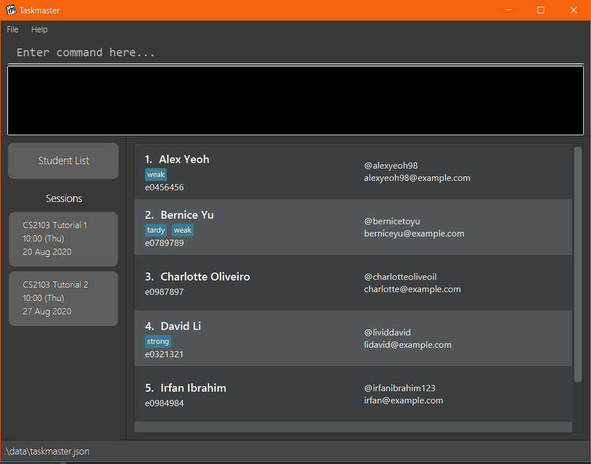

TAskmaster is a **desktop app for managing students, optimised for use via a Command Line Interface** (CLI) while still having the benefits of a Graphical User Interface (GUI). If you are a CS Teaching Assistant who can type fast, TAskmaster can help you track your students' attendance and class participation faster than traditional GUI apps.

## Contents:
- [Quick Start](#Quick-Start "Goto Quick Start")
- [GUI](#GUI "Goto GUI")
- [Commands](#Commands "Goto Commands")
    - [Adding a student: `add`](#Adding-a-student-add "Goto Adding-a-student-add")
    - [Listing all students: `list`](#Listing-all-students-list "Goto Listing-all-students-list")
    - [Deleting a student: `delete`](#Deleting-a-student-delete "Goto Deleting-a-student-delete")
    - [Adding a session: `session`](#Adding-a-session-session "Goto Adding-a-session-session")
    - [Changing the current session: `goto`](#Changing-the-current-session-goto "Goto Changing-the-current-session-goto")
    - [Marking a student's attendance: `mark`](#marking-a-students-attendance-mark "Goto marking-a-students-attendance-mark")
    - [Marking all students' attendance: `mark all`](#marking-all-students-attendance-mark-all "Goto marking-all-students-attendance-mark-all")
    - [Scoring a student's participation: `score`](#scoring-a-students-participation-score "Goto scoring-a-students-participation-score")
    - [Scoring all students' participation: `score all`](#scoring-all-students-participation-score-all "Goto scoring-all-students-participation-score-all")
    - [Clear all students: `clear`](#Clearing-all-entries-clear "Goto Clearing-all-entries-clear")
    - [Exit the program: `exit`](#Exiting-the-program-exit "Goto Exiting-the-program-exit")
- [Command Summary](#Command-Summary "Goto Command-Summary")
- [Storage](#Storage "Goto Storage")
- [FAQ](#Frequently-Asked-Questions-FAQ "Goto Frequently-Asked-Questions-FAQ")

## Quick Start
1. Ensure you have Java 11 or later installed.
2. Download the jar file from the project website.
3. Copy the file to the folder you want to use as the home folder for the application.
4. Double-click the file to start the app. A GUI should appear, with the field bar to input commands. The list of commands are available below.

## GUI


### Accessing the student lists
Click on the button titled "Students".

### Accessing a session
Click on the button with the name of the Session.

## Commands
> Command format:
> - Words in `UPPER_CASE` are parameters supplied by the user
> - Items in square brackets are optional
> - Items with ellipses (`...`) after them can be used multiple times including zero times
> - Parameters can be in any order

### Adding a student: `add`
Adds a student into the student list.
```
add n/NAME i/NUSNET_ID e/EMAIL
```

### Listing all students: `list`
Shows a list of all students in the student list.
```
list
```

### Deleting a student: `delete`
Deletes the specified student from the student list.
```
delete INDEX
```
- Deletes the student at the specified `INDEX` number shown in the displayed student list.
- The `INDEX` **must be a positive integer**.

### Adding a session: `session`
Adds a session into the session list.
```
session s/SESSION_NAME dt/SESSION_DATE_TIME
```
- The `SESSION_DATE_TIME` must be of the format `dd-MM-yyyy HHmm`.

### Changing the current session: `goto`
Changes the current session to the session with the specified name.
```
goto s/SESSION_NAME
```
- The `SESSION_NAME` must belong to one of the existing sessions in the session list.

### Marking a student's attendance: `mark`
Marks the attendance of the specified student from the student list.
```
mark INDEX a/ATTENDANCE_TYPE
```
- Marks the attendance at the specified `INDEX` number shown in the displayed student list.
- The `INDEX` **must be a positive integer**.
- The `ATTENDANCE_TYPE` must either be `present` or `absent`.

### Marking all students' attendance: `mark all`
Marks the attendance of all students in the student list.
```
mark all a/ATTENDANCE_TYPE
```
- Marks the attendances of all students shown in the displayed student list.
- The `ATTENDANCE_TYPE` must either be `present` or `absent`.

### Scoring a student's participation: `score`
Scores the participation of the specified student from the student list.
```
score INDEX cp/SCORE
```
- Scores the participation of the student associated with the specified `INDEX` number shown in the displayed student list.
- The `INDEX` and `SCORE` **must be positive integers**.

### Scoring all students' participation: `score all`
Scores the participation of all students from the student list.
```
score all INDEX cp/SCORE
```
- Scores the participation of all students shown in the displayed student list.
- The `SCORE` **must be a positive integer**.

### Clearing all entries: `clear`
Clears all students from the student list.
```
clear
```

### Exiting the program: `exit`
Exits the program.
```
exit
```

## Command Summary
| Action            | Format, Examples                                                                                              |
|-------------------|---------------------------------------------------------------------------------------------------------------|
| Add student       | ```add n/NAME i/NUSNET_ID e/EMAIL``` <br> e.g., ```add n/John Doe Kai Jie i/E9412345 e/e9412345@u.nus.edu```  |
| List students     | ```list```                                                                                               |
| Delete student    | ```delete INDEX``` <br> e.g., ```delete 3```                                                             |
| Add session       | ```session s/SESSION_NAME dt/SESSION_DATE_TIME``` <br> e.g., ```session s/CS2103 Tutorial 1 dt/23-10-2020 0900```|
| Change session    | ```goto s/SESSION_NAME``` <br> e.g., ```goto s/CS2103 Tutorial 1```
| Mark              | ```mark INDEX a/ATTENDANCE_TYPE``` <br> e.g., `mark 1 a/present`                                             |
| Mark all          | ```mark all a/ATTENDANCE_TYPE``` <br> e.g., `mark all a/present`
| Score             | ```score INDEX cp/SCORE``` <br> e.g., `score 1 cp/5`                                             |
| Score all         | ```score all cp/SCORE``` <br> e.g., `score all cp/10`
| Store Attendance  | ```store_record fn/FILENAME``` <br> e.g., `store_record tutorial01`                                |
| Load Attendance   | ```load_record fn/FILENAME```
| Clear             | ```clear```                                                                                              |

## Storage
The TAskmaster stores the running list of students and sessions automatically to JSON files when they are updated.

**Student data** is stored in `data/taskmaster.json`
**Session data** is stored in `data/session_list.json`

Avoid modifying the files as this may cause the program to read the input as invalid on startup and load with an
empty student list without any sessions.

## Frequently Asked Questions (FAQ)
How to download java? [Here](https://lmgtfy.com/?q=how+to+download+java)
